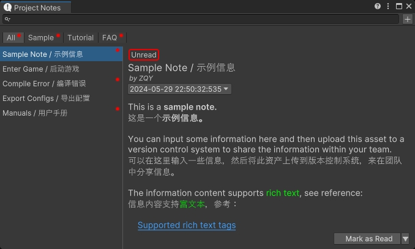
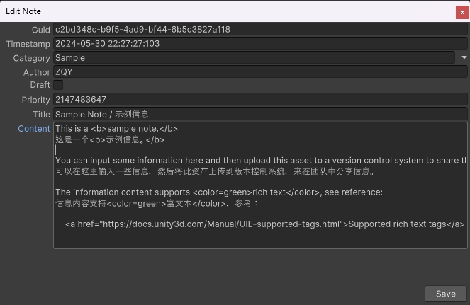

# UnityProjectNotes

[中文](./README_CN.md)

A small utility within the Unity Editor to display notes, which can be used to share information across the team.

> Have you ever been frustrated by your teammates frequently asking you the same questions? Try this.

## Features

- Displays notes in a standalone EditorWindow
- Note entries support rich text, version history, and categories
- Supports adding, editing, and deleting note entries
- Supports searching note entries by title, content, and author
- Can share notes with the team by uploading the local settings file to a version control system
- Prominently displays a notification in the Editor toolbar when new entries are added to the note settings 

## Supported Unity Versions

Unity 2021.3 or higher.

Certain features are not available in versions of Unity prior to 2022, for example:
- Unable to select the contents of a note
- Certain rich text tags (such as hyperlinks <a\>) are not supported

## Installation

Install this package via [OpenUPM](https://openupm.com/packages/com.greenbamboogames.projectnotes), or clone this repository directly into the Packages folder of your project.

## How to Use

Click the entry button in the Editor toolbar, or the menu item "Tools/Bamboo/Project Notes" to open the Project Notes window.

Click the "+" button in the top right corner of the Project Notes window to add a new note entry.

Use the search bar at the top of the Project Notes window to search for note entries.

Use the buttons and dropdown buttons in the bottom right corner of the Project Notes window to mark, edit, or delete note entries.

## Known Issues

**Changing the Unity Editor layout causes the entry button in the Editor toolbar to disappear.**

Solutions (any one of the following):

- In the context menu of the Project Notes window, select the "Create Toolbar Entry Button" option to recreate the entry button.
- Modify any code to trigger a domain reload in Unity.
- Restart the Unity Editor.